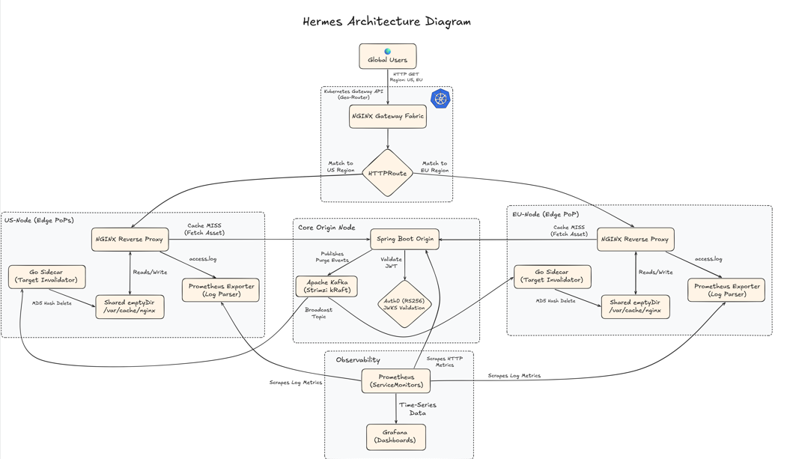

<br/>
<div align="center">
  <h1 align="center">Hermes: Local Development Global CDN Simulator</h1>
  <p align="center">
    Hermes is a locally deployable, distributed Content Delivery Network (CDN) simulator built to explore advanced backend engineering, Kubernetes orchestration, and event-driven architecture.
    It simulates a global network with a core Java Spring Boot Origin and geographically distributed NGINX Edge Proxies, featuring Layer 7 Geo-Routing, Kafka-driven cache invalidation, and full Prometheus/Grafana observability.
</div>

---

## Architecture Diagram



### The Core Components
1. **The Origin (Java 21 / Spring Boot):** A simulated heavy backend API protected by Auth0 asymmetric JWT validation.
2. **The Edge PoPs (NGINX + Go Sidecars):** Geographically distributed reverse proxies (US-East, EU-West) that cache assets and enforce token-bucket rate limiting (DDoS protection).
3. **The Geo-Router (Kubernetes Gateway API):** An L7 NGINX Gateway Fabric that reads `X-User-Region` headers and routes traffic to the closest physical Edge PoP.
4. **The Event Broker (Apache Kafka / Strimzi):** A KRaft-mode Kafka cluster that broadcasts cache-purge events globally.
5. **The Invalidator (Go / Golang):** A custom sidecar microservice that listens to Kafka, computes NGINX MD5 cache keys, and performs targeted file deletions on shared local volumes.
6. **Prometheus & Grafana:** A full observability stack utilizing custom `ServiceMonitors` and Log Exporter sidecars to track global Cache Hit/Miss ratios in real-time.

---

## Key Technical Achievements
- **Decoupled Control & Data Planes:** Utilized modern Kubernetes Gateway API over legacy Ingress for dynamic, unprivileged port routing.
- **Event-Driven Targeted Purging:** Solved the "Cache Stampede" problem by implementing a Go sidecar that calculates MD5 hashes of cache keys to delete specific assets without wiping the entire edge cache.
- **Service Discovery:** Leveraged Prometheus label-selectors to automatically discover and scrape new Edge PoPs as they scale, without rewriting monitoring configurations.
- **Zero-Trust Edge Security:** Enforced strict Auth0 JWT validation at the Origin, ensuring that even if the Edge is compromised, unauthorized requests are rejected.
- **Automated Load Testing:** Validated system resilience and rate-limiting using automated tests scripts simulating concurrent virtual users across global regions.

---

## Tech Stack

| Category              | Technologies                           | 
|-----------------------|----------------------------------------|
| **Languages**         | Java, Go                               |
| **Infrastructure**    | Kubernetes (Kind), Docker, Helm        |
| **Routing & Caching** | NGINX, Kubernetes Gateway API          |
| **Event Streaming**   | Apache Kafka (Strimzi Operator)        |
| **Observability**     | Prometheus, Grafana, Micrometer        |
| **Security**          | Spring Security, Auth0 (OAuth2 / JWKS) |

---

## Local Setup

### Prerequisites
* Docker Desktop
* Kubernetes `kind` CLI
* `kubectl` and `helm`

1. **Clone the repository**
    ``` bash
    git clone https://github.com/YOUR-USERNAME/Hermes.git 
    cd Hermes
    ```
2.  **Provision the Global Cluster**
    ```bash
    kind create cluster --config ./k8s/cluster-setup/kind-config.yaml
    ```
3. **Deploy Infrastructure Operators**
   ```bash
   # Install Gateway API & NGINX Fabric
   kubectl apply -f https://github.com/kubernetes-sigs/gateway-api/releases/download/v1.2.0/standard-install.yaml
   helm install ngf oci://ghcr.io/nginx/charts/nginx-gateway-fabric -n nginx-gateway --create-namespace
   ```
   ```bash
   # Install Strimzi Kafka Operator
   helm install strimzi-kafka-operator strimzi/strimzi-kafka-operator -n kafka --create-namespace
   ```
4. **Build & Load Microservices**
   ```bash
   # Build Origin (Java) and Invalidator (Go) using Multi-Stage Dockerfiles
   docker build -t hermes/origin-service:1.2.0 ./src/origin-service
   docker build -t hermes/invalidator-sidecar:1.0.2 ./src/invalidator-sidecar
    
   kind load docker-image hermes/origin-service:1.2.0 --name hermes-cluster
   kind load docker-image hermes/invalidator-sidecar:1.0.2 --name hermes-cluster
   ```
5. **Apply Manifest**
   ```bash
   kubectl apply -f ./k8s/kafka/kafka-cluster.yaml -n kafka
   kubectl apply -f ./k8s/origin/
   kubectl apply -f ./k8s/edge-pops/
   kubectl apply -f ./k8s/geo-router/
   ```
6. **Test the CDN Manually**
   ```bash
   # Route to US Edge
   curl -i -H "X-User-Region: US" -H "Authorization: Bearer <TOKEN>" http://localhost:8080/api/v1/assets/tests-image

   # Route to EU Edge
   curl -i -H "X-User-Region: EU" -H "Authorization: Bearer <TOKEN>" http://localhost:8080/api/v1/assets/tests-image
   ```
7. **Load Testing & Observability Validation**
   - To truly see the CDN in action, Hermes includes a load testing suite in the tests/ directory. This script simulates 50 concurrent virtual users for 30 seconds, randomizing geographic regions (X-User-Region) and spoofing IP addresses to trigger NGINX rate limits.
     1. Ensure your Gateway port-forward is running: kubectl port-forward svc/hermes-global-gateway-nginx 8080:8080
     2. Open Grafana (http://localhost:3000) and navigate to your Explore tab to watch the upstream_cache_status metrics.
     3. Execute the load tests:
     ```bash
     # Navigate to the tests directory and run the load tests script
     cd tests
     k6 run load-tests.js 
     ```
     Expected Results in Grafana: You will see an initial spike in MISS metrics as the caches warm up, followed by a massive sustained spike in HIT metrics. You will also observe requests being dropped (HTTP 503s) as the randomized IPs hit the strict 1 req/sec NGINX Token-Bucket rate limit!
